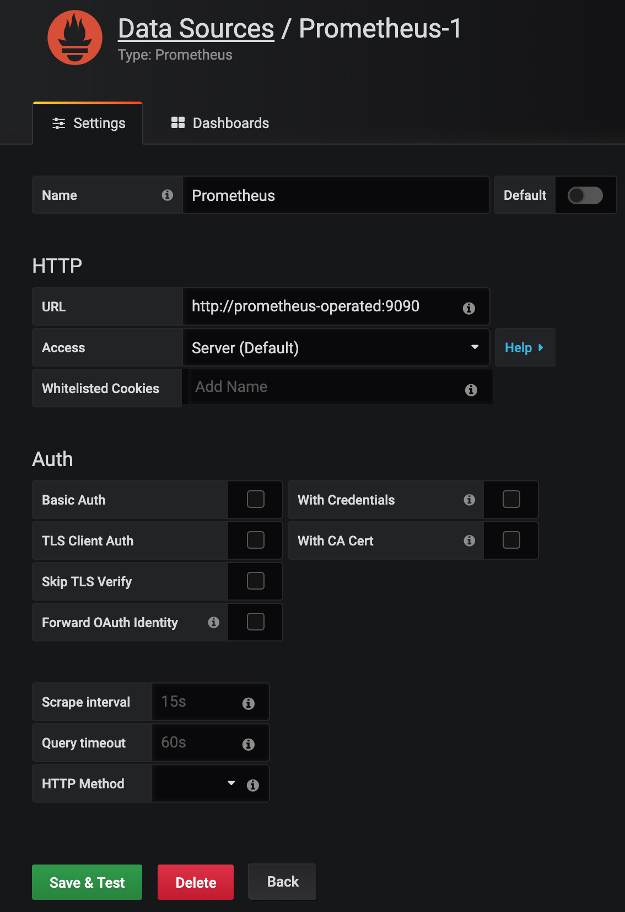
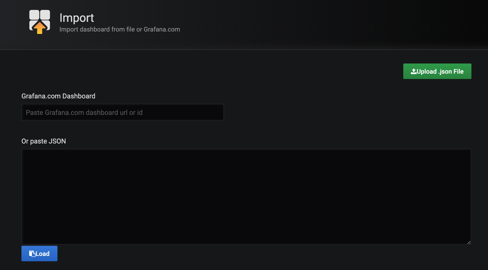

# Kafka on Minikube Installation Guide

## Requirements

* Kubernetes in version >= 1.14 installed in Minikube
* installed and configured `kubectl`
* installed and configured `helm`

### Install Strimzi Repo via Helm

Link to Strimzi main page: [strimzi.io](https://strimzi.io/)

Add repository:

```sh
helm repo add strimzi http://strimzi.io/charts/
```

Check if repository has been added:

```sh
$ helm search strimzi/ --versions
NAME                           CHART VERSION APP VERSION DESCRIPTION
strimzi/strimzi-kafka-operator 0.12.1        0.12.1      Strimzi: Kafka as a Service
strimzi/strimzi-kafka-operator 0.12.0        0.12.0      Strimzi: Kafka as a Service
strimzi/strimzi-kafka-operator 0.11.4        0.11.4      Strimzi: Kafka as a Service
strimzi/strimzi-kafka-operator 0.11.3        0.11.3      Strimzi: Kafka as a Service
```

### Install Strimzi Operator

```sh
helm install strimzi/strimzi-kafka-operator
```

or install specified version:

```sh
helm install strimzi/strimzi-kafka-operator --name pgs-strimzi-release --namespace kafka --version 0.12.1
```

All parameters which might be used during Kafka installation: [README.md](https://github.com/strimzi/strimzi-kafka-operator/blob/master/helm-charts/strimzi-kafka-operator/README.md)

Detailed `helm` installation documentation available [HERE](https://strimzi.io/2018/11/01/using-helm.html)

### Create Namespace for Kafka cluster - it should be already created by helm

```sh
kubectl create namespace kafka
```

### Install single pod Kafka with zookeeper

```sh
kubectl apply -f resources/kafka-simple-single.yaml
```

### See in realtime how zookeeper and kafka are starting

```sh
$ watch kubectl get pods -n kafka
Every 2.0s: kubectl get pods -n kafka          Mateuszs-MacBook-Pro.local: Thu Jun 27 15:10:46 2019

NAME                                           READY   STATUS    RESTARTS   AGE
pgs-cluster-entity-operator-85d4c86f7c-tpvn6   3/3     Running   0          87s
pgs-cluster-kafka-0                            2/2     Running   0          113s
pgs-cluster-zookeeper-0                        2/2     Running   0          2m17s
strimzi-cluster-operator-6849d55bf-mbsb2       1/1     Running   0          3m4s
```

### Check the PersistentVolumeClaims

```sh
$ kubectl get pvc -n kafka
NAME                           STATUS   VOLUME                                     CAPACITY   ACCESS MODES   STORAGECLASS   AGE
data-0-pgs-cluster-kafka-0     Bound    pvc-c5e92cfa-24c3-4306-8db9-9a6a21683a82   10Gi       RWO            standard       88s
data-pgs-cluster-zookeeper-0   Bound    pvc-c5579637-012e-469a-85f6-b333cf4f43be   10Gi       RWO            standard       112s
```

### Open Dashboard

```sh
minikube dashboard
```

### Final test

Let's write some messages to Kafka:

```sh
kubectl -n kafka run kafka-producer -ti --image=strimzi/kafka:0.12.1-kafka-2.2.1 --rm=true --restart=Never -- bin/kafka-console-producer.sh --broker-list pgs-cluster-kafka-bootstrap:9092 --topic pgs-topic
```

And read them:

```sh
kubectl -n kafka run kafka-consumer -ti --image=strimzi/kafka:0.12.1-kafka-2.2.1 --rm=true --restart=Never -- bin/kafka-console-consumer.sh --bootstrap-server pgs-cluster-kafka-bootstrap:9092 --topic pgs-topic --from-beginning
```

Or use buildin `perf` test tool:

```sh
kubectl -n kafka run kafka-perf-producer -ti --image=strimzi/kafka:0.12.1-kafka-2.2.1 --rm=true --restart=Never -- bin/kafka-producer-perf-test.sh --topic pgs-topic --num-records 1000000 --record-size 100 --throughput 1000 --producer-props bootstrap.servers=pgs-cluster-kafka-bootstrap:9092
```

### Scale up our cluster

Change line 9 in file: `resources/kafka-simple-single.yaml`

```sh
    replicas: 1 -> 3
```

And apply changes in Kafka cluster:

```sh
kubectl apply -f resources/kafka-simple-single.yaml
```

### See in realtime how Kafka cluster is scaled up

```sh
watch kubectl get pods -n kafka
```

### Run perf kafka producer

```sh
kubectl -n kafka run kafka-perf-producer -ti --image=strimzi/kafka:0.12.1-kafka-2.2.1 --rm=true --restart=Never -- bin/kafka-producer-perf-test.sh --topic pgs-topic --num-records 1000000 --record-size 100 --throughput 1000 --producer-props bootstrap.servers=pgs-cluster-kafka-bootstrap:9092
```

### Remove comment in line 19 in file `resources/kafka-simple-single.yaml`

Apply changes in Kafka cluster:

```sh
kubectl apply -f resources/kafka-simple-single.yaml
```

### See in realtime how Kafka brokers are restarted one by one

```sh
watch kubectl get pods -n kafka
```

## Monitoring

Create `monitoring` namespace:

```sh
kubectl create namespace monitoring
```

Install Prometheus Operator:

```sh
kubectl apply -f resources/prometheus/operator/prometheus-operator-service-account.yaml
kubectl apply -f resources/prometheus/operator/prometheus-operator-service.yaml
kubectl apply -f resources/prometheus/operator/prometheus-operator-service-monitor.yaml
kubectl apply -f resources/prometheus/operator/prometheus-operator-cluster-role.yaml
kubectl apply -f resources/prometheus/operator/prometheus-operator-cluster-role-binding.yaml
kubectl apply -f resources/prometheus/operator/prometheus-operator-deployment.yaml
```

Install Prometheus:

```sh
kubectl create secret generic additional-scrape-configs --from-file=resources/prometheus/prometheus-additional.yaml -n monitoring
kubectl apply -f resources/prometheus/strimzi-service-monitor.yaml
kubectl apply -f resources/prometheus/prometheus-rules.yaml
kubectl apply -f resources/prometheus/prometheus.yaml
```

Install Grafana:

```sh
kubectl apply -f resources/grafana/grafana.yaml
```

### See in realtime how Prometheus and Grafana are starting

```sh
watch kubectl get pods -n monitoring
```

### Open Grafana

Open: [http://192.168.99.100:31111/](http://192.168.99.100:31111/)

User/Pass: admin/admin

### Add Datasource



### Import Dashboards

Dashboards -> Manage -> Import



Copy and paste `resources/grafana/dashboards/kafka.json` and Import

Copy and paste `resources/grafana/dashboards/zookeeper.json` and Import

### Run Perf Tests of Kafka

```sh
kubectl -n kafka run kafka-perf-producer -ti --image=strimzi/kafka:0.12.1-kafka-2.2.1 --rm=true --restart=Never -- bin/kafka-producer-perf-test.sh --topic pgs-topic --num-records 1000000 --record-size 100 --throughput 1000 --producer-props bootstrap.servers=pgs-cluster-kafka-bootstrap:9092
```

### Get back to Grafana Dashboard and watch the mertics