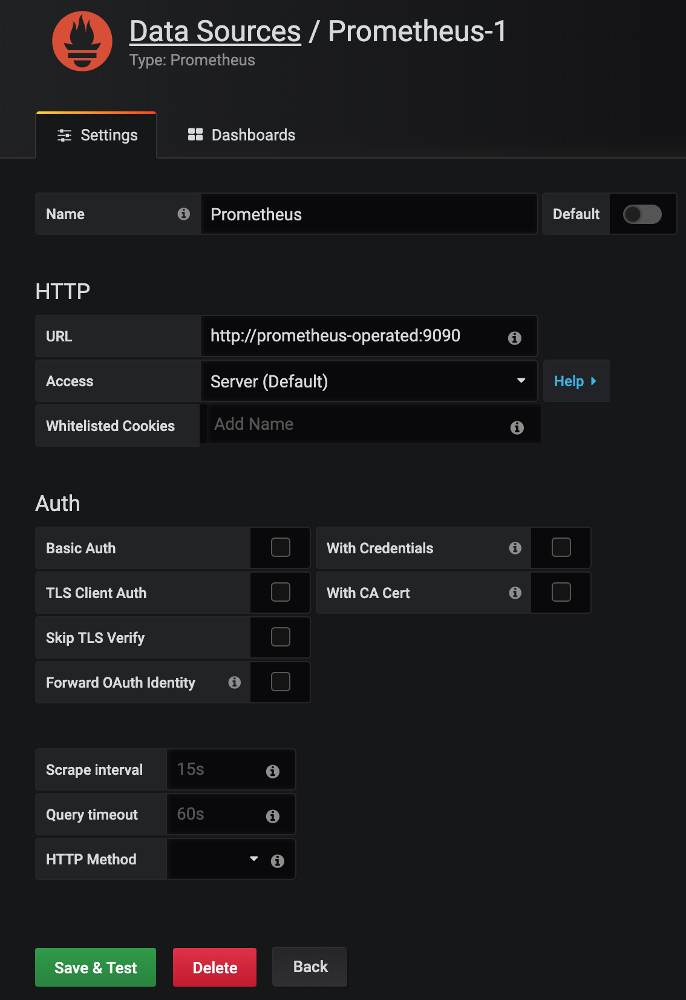
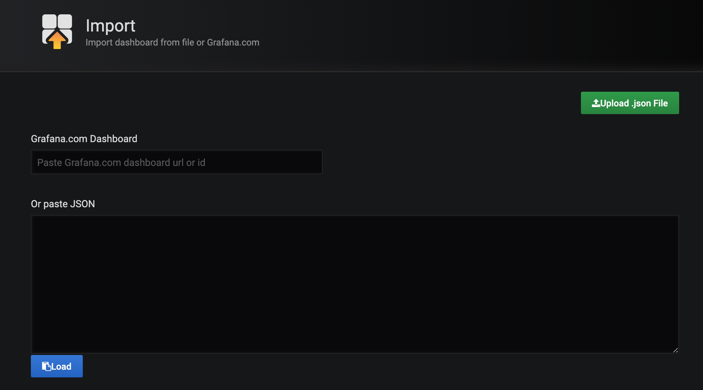

# Monitoring

Create `monitoring` namespace:

```sh
kubectl create namespace monitoring
```

Install Prometheus Operator:

```sh
kubectl apply -f resources/prometheus/operator/prometheus-operator-service-account.yaml
kubectl apply -f resources/prometheus/operator/prometheus-operator-service.yaml
kubectl apply -f resources/prometheus/operator/prometheus-operator-service-monitor.yaml
kubectl apply -f resources/prometheus/operator/prometheus-operator-cluster-role.yaml
kubectl apply -f resources/prometheus/operator/prometheus-operator-cluster-role-binding.yaml
kubectl apply -f resources/prometheus/operator/prometheus-operator-deployment.yaml
```

Install Prometheus:

```sh
kubectl create secret generic additional-scrape-configs --from-file=resources/prometheus/prometheus-additional.yaml -n monitoring
kubectl apply -f resources/prometheus/strimzi-service-monitor.yaml
kubectl apply -f resources/prometheus/prometheus-rules.yaml
kubectl apply -f resources/prometheus/prometheus.yaml
```

Install Grafana:

```sh
kubectl apply -f resources/grafana/grafana.yaml
```

## See in realtime how Prometheus and Grafana are starting

```sh
watch kubectl get pods -n monitoring
```

## Open Grafana

Open: [http://192.168.99.100:31111/](http://192.168.99.100:31111/)

User/Pass: admin/admin

## Add Datasource



## Import Dashboards

Dashboards -> Manage -> Import



Copy and paste `resources/grafana/dashboards/kafka.json` and Import

Copy and paste `resources/grafana/dashboards/zookeeper.json` and Import

## Run Perf Tests of Kafka

```sh
kubectl -n kafka run kafka-perf-producer -ti --image=strimzi/kafka:0.12.1-kafka-2.2.1 --rm=true --restart=Never -- bin/kafka-producer-perf-test.sh --topic pgs-topic --num-records 1000000 --record-size 100 --throughput 1000 --producer-props bootstrap.servers=pgs-cluster-kafka-bootstrap:9092
```

## Get back to Grafana Dashboard and watch the mertics
